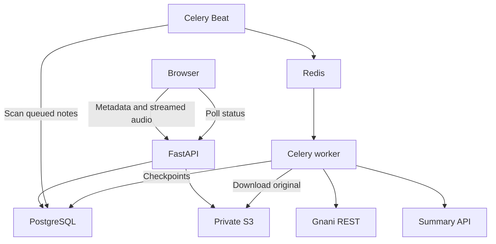

# Implementation architecture

## Data flow

The original audio never goes in PostgreSQL or Redis. Redis carries UUIDs and run tokens, not audio or transcript text. A queued PostgreSQL row is the durable intent to process. There is no Celery result backend: application results are stored in PostgreSQL.

## API contract

All application errors have `{"error":{"message":"Safe explanation"}}`. UUID parsing and request validation return 422. Responses omit storage keys and run tokens. OpenAPI is available at `/docs` on the API service.

| Method and route | Input | Success | Important failures |
|---|---|---|---|
| `POST /api/audio-notes` | JSON `filename`, `file_size`, `language`, UUID `upload_key` | 201 note; duplicate key with same metadata returns same note | 413 size; 422 metadata; 409 reused key with changed metadata |
| `PUT /api/audio-notes/{id}/content` | Raw file body; `application/octet-stream` | 200 queued note after S3 transfer | 400 incomplete; 413 excessive; 409 closed upload; 503 storage |
| `GET /api/audio-notes?page=1` | Page >=1, <=10000 | 20 note summaries plus total/page/page_size | 422 invalid page |
| `GET /api/audio-notes/{id}` | UUID | Full note, transcript and summary | 404 missing |
| `GET /api/audio-notes/{id}/status` | UUID | State, chunk counts, failure, attempts and update time | 404 missing |
| `GET /api/audio-notes/{id}/playback` | UUID | One-hour signed URL | 409 original not saved |
| `POST /api/audio-notes/{id}/retry` | No body | 200 queued note with fresh run token | 409 active, unrecoverable, not uploaded or max attempts |
| `GET /api/config` | None | Public limits and repository URL | No credentials returned |
| `GET /health/live` | None | Process alive | Does not check dependencies |
| `GET /health/ready` | None | Database/schema query succeeds | 503 database/schema issue |

Readiness intentionally checks API and DB, not every external provider. It does not prove worker availability. Operational checks must monitor worker and Beat processes too.

## Lifecycle and concurrency

`UPLOADING → QUEUED → TRANSCRIBING → SUMMARIZING → COMPLETED`.

Failures move any active state to `FAILED`. A retryable, fully uploaded note can move from `FAILED` to `QUEUED` with a fresh token and incremented attempt count. Checkpoints are accepted only for the current token and active processing states. Transcription chunks remain immutable for an original because an upload cannot replace content after the initial upload state.

Upload and worker operations use the same per-note PostgreSQL session advisory lock. Short row transactions run on other connections. No row lock is held during a provider HTTP request. A retry uses `SELECT FOR UPDATE` to serialize simultaneous retry clicks. A 64-bit UUID-derived lock key has a theoretical hash collision; a collision temporarily serializes unrelated notes rather than corrupting data.

The dispatcher selects queued notes with `FOR UPDATE SKIP LOCKED`, publishes, then commits `dispatched_at`. The row becomes eligible again after 60 seconds if no worker changes its state. Publishing before the commit favors duplicate delivery over lost work. Duplicate workers cannot run concurrently while the advisory-lock connection remains alive. A lost lock connection can permit external overlap; token/state checks constrain DB writes, but do not create an external exactly-once guarantee.

## Gnani contract

Checked 2026-10-02 against https://docs.gnani.ai/api/STT/speech-to-text.

The adapter uses the documented REST v3 multipart endpoint, `X-API-Key-ID`, an `audio_file` part and `language_code`. It validates the response success flag and string transcript. Request construction lives only in `services/providers.py`; the worker supplies decoded WAV chunks. No timestamp segments are invented.

The linked endpoint has a 60-second ceiling. Thirty-second chunks keep each request comfortably below it. The batch API is a legitimate alternative (https://docs.gnani.ai/api/STTBatch/Introduction) but was not chosen for this implementation. The user-facing formats match the linked REST contract; FFprobe validates actual decodability and FFmpeg normalizes the bytes before sending.

## Summary strategy

A `SummaryProvider` Protocol is the only summary-provider abstraction. `OpenAISummary` makes a direct OpenAI-compatible Chat Completions call. `summarize_long` splits text by UTF-8 bytes, calls the provider, and recursively reduces summaries. Each source input is at most 12,000 bytes; the default model has ample room for instructions and 700 output tokens. Changing providers/models requires checking tokenization, supported parameters and context size.

The reducer heartbeats before and after each request, rejects empty speech, truncated responses and non-shrinking multi-part results, and permits at most eight passes. It preserves all input characters in order, although a cut can divide a word. Summaries can omit nuance or hallucinate despite instructions; the original and transcript remain available for comparison.

## Synchronous versus asynchronous

The HTTP upload waits for transfer into S3 because the system must not queue a missing file. That is bounded I/O, not ASR/LLM processing. The client shows real transfer percentage, then a saving state while S3 finishes. Temp files are removed using context managers. The browser can close after the queued response.

The worker performs download, media validation, chunk extraction, transcription and summary generation. API handlers never call Gnani or the LLM. Provider HTTP operations have timeouts and at most three transient attempts. Total worker hard execution is capped at six hours.

## Failure windows

- Crash during upload: record remains uploading until stale recovery marks failure; start a new upload.
- S3 succeeds, DB update fails: the key remains on the upload record, but automatic processing does not assume it is complete. The user sees failure after recovery; the object may need retention cleanup.
- DB queue commit succeeds, Redis unavailable: next dispatcher scan retries the publish.
- Publish succeeds, dispatcher commit fails: duplicate publication; worker lock/state checks protect the row.
- Worker dies: late acknowledgements allow Redis redelivery; stale recovery also makes the failure actionable after 15 minutes. A manual retry reuses saved ASR chunks.
- Provider succeeds, checkpoint fails: that one request may repeat and incur a second charge.
- Summary fails: transcript remains accessible; saved ASR chunks are reused on retry.
- Beat dies: list/detail/status reads still mark stale work failed, but no new jobs dispatch until Beat returns.
- DB unavailable: the client displays connectivity/service errors; SQL error bodies never reach the browser. Recovery requires restoring the DB.

## Operational limits

API temp disk is proportional to concurrent uploads; worker temp disk is proportional to worker slots and original size. Boto3 multipart transfer buffers are bounded but not zero. The database keeps transcript chunks plus joined transcript, intentionally duplicating small text for simple recovery. Status serialization currently loads one model including text internally; its response is lightweight, but a column-only DB query is a future optimization.

The app is not horizontally infinite: two worker slots, server-mediated uploads and serial per-note chunk requests favor explainability. Ten thousand simultaneous uploads need admission control, per-user budgets, direct S3 multipart upload, queue backpressure, enough disk/DB connections, provider-aware throttling and monitoring before simply adding workers.
